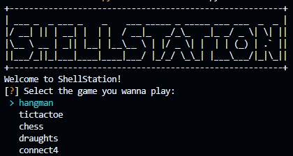

# ShellStation

ShellStation is a command-line game suite. It allows users to select and play games through an interactive menu, directly via command-line arguments, or run automated tests/matches for each game.

## Previews


    

## Features

- **Interactive Game Selection**: Users can choose which game to play through a simple command-line menu.
- **Direct Game Launch**: Users have the option to directly start a game using command-line arguments.
- **Automated Tests**: Users can run automated matches for each game using command-line arguments.
- **Extensible**: Adding new games is as straightforward as updating the `ShellStation` class and adding the game files.

## Prerequisites

Before running ShellStation, ensure you have Python installed on your system. The games are built with Python 3.11.

## Installation

1. Clone the repository:
    ```bash
    git clone https://github.com/kelvinleandro/shellstation
    ```

2. Change to the project directory:
    ```bash
    cd shellstation
    ```

3. Install the required libraries:
    ```bash
    pip install -r requirements.txt
    ```

## Usage

To start ShellStation in interactive mode:

```bash
python shellstation.py
```

To directly start a specific game:

```bash
python shellstation.py -g chess
```

The game will ask you to specify a host and port. For example, you can enter:

```bash
localhost 9999
```

To run automated tests for a specific game:

```bash
python shellstation.py -t chess
```

### Available commands

- `-g`, `--game`: Start with the specified game. Options: chess, draughts, tictactoe, hangman, connect4.
- `-t`, `--test`: Run the specified test. Options: chess, draughts, tictactoe, hangman, connect4.

## Tests

`test` folder contains simulated matches for each game using `pyautogui`.

To run the automated matches:

```bash
python shellstation.py -t GAME_OPTION
```

## License

This project is licensed under the MIT License - see the LICENSE file for details.

